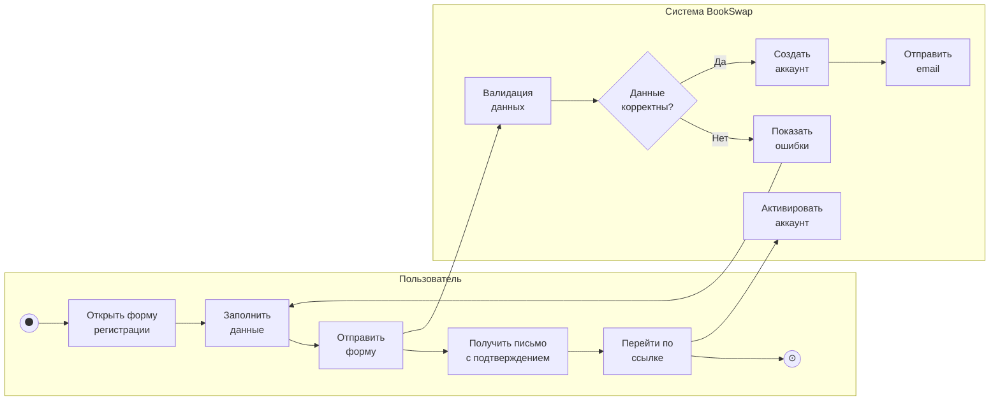
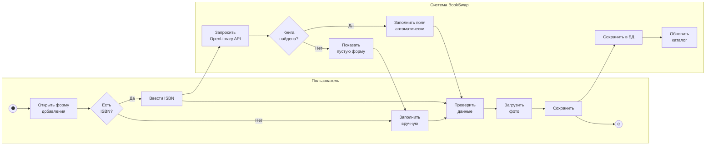
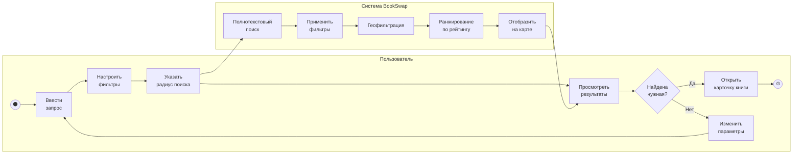
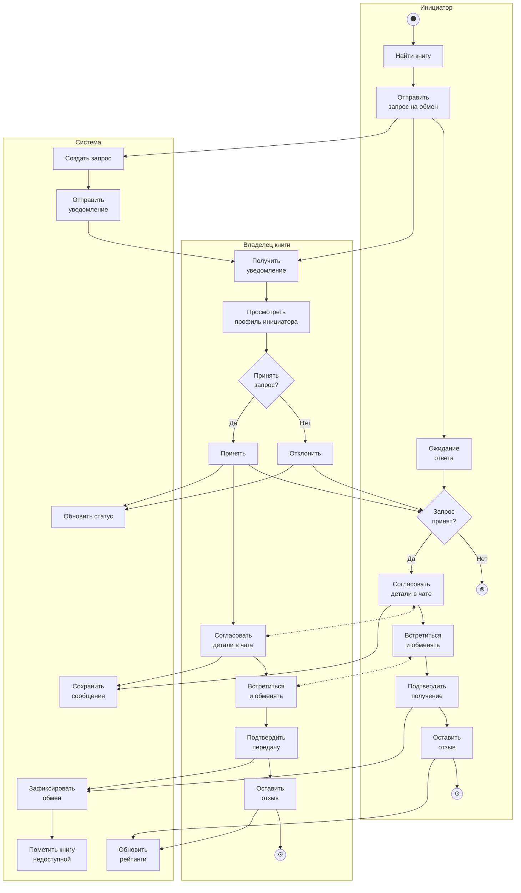
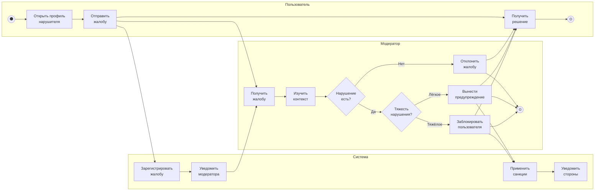

# 2.5. Модель в нотации BPMN

## Процесс «Регистрация пользователя»

## Процесс «Добавление книги»

## Процесс «Поиск книги»

## Процесс «Обмен книгами» (основной)

## Процесс «Модерация жалобы»

## Комментарии к модели BPMN

### Процесс «Регистрация пользователя»

Описывает создание нового аккаунта с подтверждением email.

**Участники:**
- Пользователь — заполняет форму и подтверждает email
- Система — валидирует данные, создаёт аккаунт, отправляет письмо

**Ключевые точки:**
- Шлюз «Данные корректны?» — проверка на уникальность email, корректность пароля
- Активация происходит только после перехода по ссылке из письма

### Процесс «Добавление книги»

Демонстрирует два сценария: автозаполнение по ISBN и ручной ввод.

**Особенности:**
- Интеграция с OpenLibrary API для получения метаданных
- При отсутствии книги в API — ручное заполнение
- Возможность загрузки фотографий обложки и состояния книги

### Процесс «Поиск книги»

Показывает многоступенчатую фильтрацию с геолокацией.

**Этапы обработки в системе:**
1. Полнотекстовый поиск по названию/автору
2. Применение фильтров (жанр, состояние, язык)
3. Геофильтрация по радиусу от пользователя
4. Ранжирование по рейтингу владельца
5. Отображение результатов на карте

### Процесс «Обмен книгами»

Центральный бизнес-процесс платформы с тремя пулами участников.

**Инициатор:**
- Находит книгу → отправляет запрос → ожидает решения
- При положительном ответе — согласование, встреча, подтверждение, отзыв
- При отклонении — процесс завершается

**Владелец книги:**
- Получает уведомление → изучает профиль инициатора
- Принимает решение о передаче книги
- Параллельно с инициатором проходит этапы согласования и обмена

**Система:**
- Создаёт и хранит запрос
- Отправляет уведомления на каждом этапе
- Фиксирует завершение обмена и обновляет рейтинги
- Помечает книгу как недоступную

### Процесс «Модерация жалобы»

Описывает обработку нарушений правил платформы.

**Сценарии:**
- Жалоба отклонена — нарушения нет
- Лёгкое нарушение — предупреждение пользователю
- Тяжёлое нарушение — блокировка аккаунта

**Роль системы:**
- Регистрация жалобы и уведомление модератора
- Автоматическое применение санкций после решения
- Информирование обеих сторон о результате