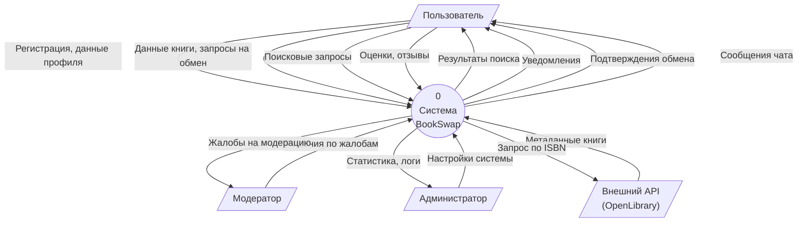
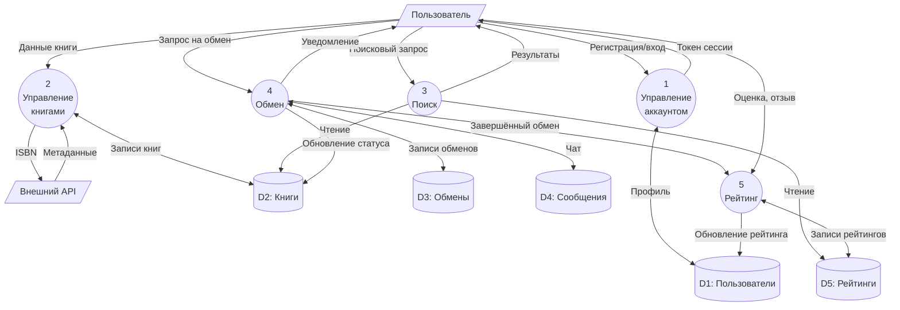
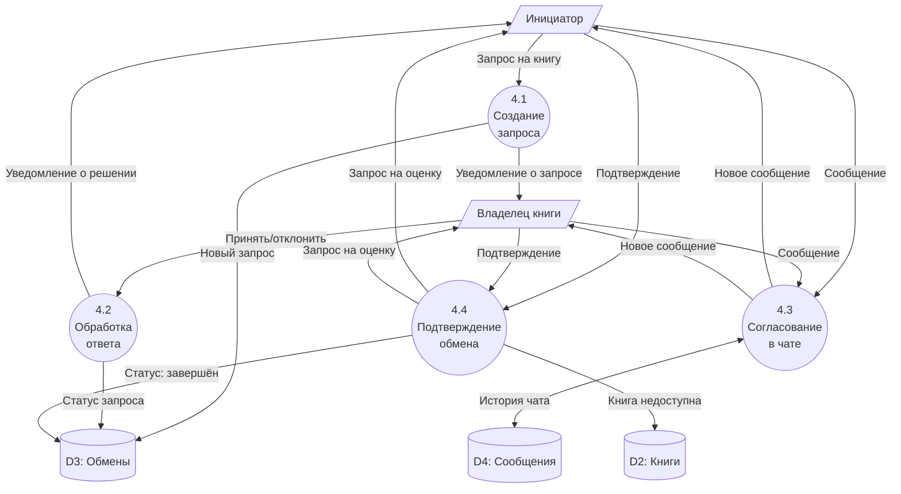

# 2.4. Фрагменты модели в нотации DFD

## Контекстная диаграмма (уровень 0)

## Диаграмма уровня 1 — Декомпозиция системы

## Фрагмент: Процесс «Обмен книгами» (уровень 2)

## Комментарии к модели DFD

### Контекстная диаграмма (уровень 0)

Показывает границы системы и её взаимодействие с внешними сущностями:

**Внешние сущности:**
- *Пользователь* — основной актор, выполняет большинство операций: регистрация, добавление книг, поиск, обмен, оценка
- *Модератор* — получает жалобы и выносит решения по спорным ситуациям
- *Администратор* — управляет настройками системы, получает статистику и логи
- *Внешний API (OpenLibrary)* — источник метаданных о книгах по ISBN

**Ключевые потоки данных:**
- Входящие от пользователя: регистрационные данные, информация о книгах, поисковые запросы, оценки
- Исходящие к пользователю: результаты поиска, уведомления, подтверждения, сообщения чата

### Диаграмма уровня 1

Система декомпозирована на пять основных процессов:

**Процесс 1: Управление аккаунтом**
Регистрация, аутентификация, редактирование профиля. Взаимодействует с хранилищем D1 (Пользователи). Выдаёт токен сессии для авторизации в других процессах.

**Процесс 2: Управление книгами**
Добавление, редактирование, удаление книг. Может запрашивать метаданные у внешнего API по ISBN. Работает с хранилищем D2 (Книги).

**Процесс 3: Поиск**
Принимает поисковый запрос, читает данные из хранилищ D2 (Книги) и D5 (Рейтинги) для ранжирования. Возвращает отсортированные результаты.

**Процесс 4: Обмен**
Центральный бизнес-процесс. Обрабатывает запросы на обмен, управляет чатом, фиксирует завершение сделки. Работает с хранилищами D3 (Обмены), D4 (Сообщения), обновляет статус в D2.

**Процесс 5: Рейтинг**
Собирает оценки после завершения обмена, рассчитывает средний рейтинг, обновляет данные в D5 (Рейтинги) и D1 (Пользователи).

**Хранилища данных:**
- D1: Пользователи — профили, учётные данные, рейтинг
- D2: Книги — каталог книг всех пользователей
- D3: Обмены — записи о запросах и их статусах
- D4: Сообщения — история чатов между пользователями
- D5: Рейтинги — оценки и отзывы

### Фрагмент уровня 2: Процесс «Обмен»

Детализация процесса 4 на четыре подпроцесса:

**4.1 Создание запроса** — инициатор выбирает книгу и отправляет запрос. Создаётся запись в D3, владельцу уходит уведомление.

**4.2 Обработка ответа** — владелец принимает или отклоняет запрос. Статус обновляется в D3, инициатор получает уведомление.

**4.3 Согласование в чате** — стороны обмениваются сообщениями для уточнения деталей (время, место). История сохраняется в D4.

**4.4 Подтверждение обмена** — обе стороны подтверждают факт обмена. Статус в D3 меняется на «завершён», книга помечается как недоступная в D2, обоим участникам отправляется запрос на оценку.