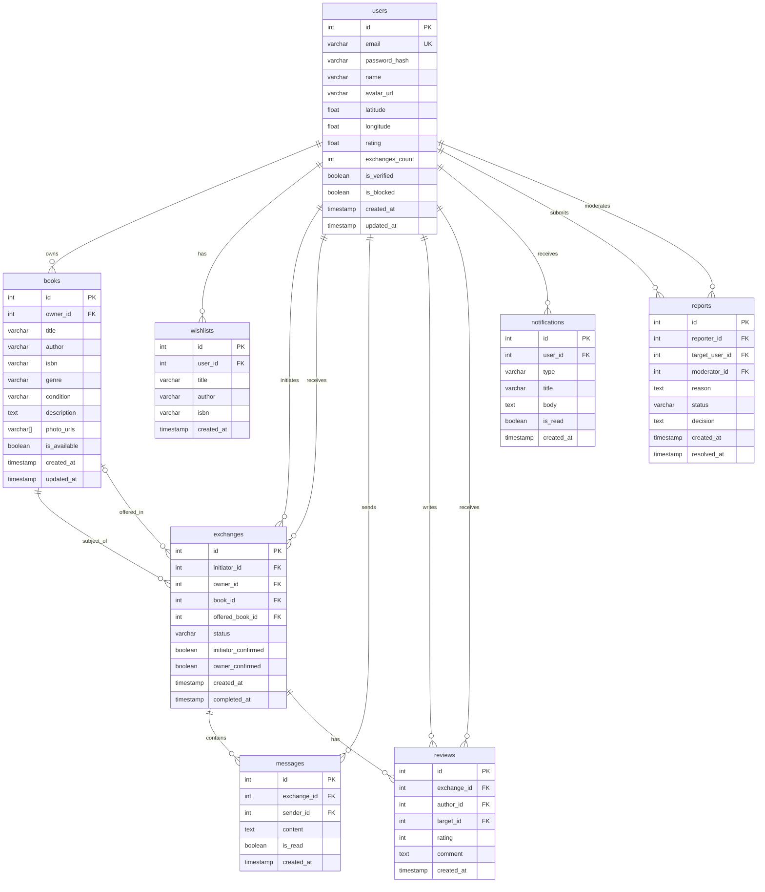

# 2.7. ER-диаграмма

## Диаграмма сущность-связь



## Описание сущностей

### users (Пользователи)

| Поле | Тип | Описание |
|------|-----|----------|
| id | INT, PK | Уникальный идентификатор |
| email | VARCHAR(255), UK | Email (уникальный) |
| password_hash | VARCHAR(255) | Хэш пароля (bcrypt) |
| name | VARCHAR(100) | Отображаемое имя |
| avatar_url | VARCHAR(500) | URL аватара |
| latitude | FLOAT | Широта (геолокация) |
| longitude | FLOAT | Долгота (геолокация) |
| rating | FLOAT | Средний рейтинг (1.0–5.0) |
| exchanges_count | INT | Количество успешных обменов |
| is_verified | BOOLEAN | Подтверждён ли email |
| is_blocked | BOOLEAN | Заблокирован ли аккаунт |
| created_at | TIMESTAMP | Дата регистрации |
| updated_at | TIMESTAMP | Дата последнего обновления |

### books (Книги)

| Поле | Тип | Описание |
|------|-----|----------|
| id | INT, PK | Уникальный идентификатор |
| owner_id | INT, FK | Владелец книги → users.id |
| title | VARCHAR(255) | Название |
| author | VARCHAR(255) | Автор |
| isbn | VARCHAR(20) | ISBN (опционально) |
| genre | VARCHAR(50) | Жанр |
| condition | VARCHAR(20) | Состояние: new / good / fair |
| description | TEXT | Описание от владельца |
| photo_urls | VARCHAR[] | Массив URL фотографий |
| is_available | BOOLEAN | Доступна ли для обмена |
| created_at | TIMESTAMP | Дата добавления |
| updated_at | TIMESTAMP | Дата последнего обновления |

### wishlists (Список желаемого)

| Поле | Тип | Описание |
|------|-----|----------|
| id | INT, PK | Уникальный идентификатор |
| user_id | INT, FK | Пользователь → users.id |
| title | VARCHAR(255) | Название желаемой книги |
| author | VARCHAR(255) | Автор (опционально) |
| isbn | VARCHAR(20) | ISBN (опционально) |
| created_at | TIMESTAMP | Дата добавления |

### exchanges (Обмены)

| Поле | Тип | Описание |
|------|-----|----------|
| id | INT, PK | Уникальный идентификатор |
| initiator_id | INT, FK | Инициатор → users.id |
| owner_id | INT, FK | Владелец книги → users.id |
| book_id | INT, FK | Запрашиваемая книга → books.id |
| offered_book_id | INT, FK | Предложенная в обмен книга → books.id (опционально) |
| status | VARCHAR(20) | Статус: pending / accepted / rejected / completed / cancelled |
| initiator_confirmed | BOOLEAN | Подтверждение от инициатора |
| owner_confirmed | BOOLEAN | Подтверждение от владельца |
| created_at | TIMESTAMP | Дата создания запроса |
| completed_at | TIMESTAMP | Дата завершения обмена |

### messages (Сообщения)

| Поле | Тип | Описание |
|------|-----|----------|
| id | INT, PK | Уникальный идентификатор |
| exchange_id | INT, FK | Обмен → exchanges.id |
| sender_id | INT, FK | Отправитель → users.id |
| content | TEXT | Текст сообщения |
| is_read | BOOLEAN | Прочитано ли |
| created_at | TIMESTAMP | Дата отправки |

### reviews (Отзывы)

| Поле | Тип | Описание |
|------|-----|----------|
| id | INT, PK | Уникальный идентификатор |
| exchange_id | INT, FK | Обмен → exchanges.id |
| author_id | INT, FK | Автор отзыва → users.id |
| target_id | INT, FK | Получатель отзыва → users.id |
| rating | INT | Оценка (1–5) |
| comment | TEXT | Текст отзыва |
| created_at | TIMESTAMP | Дата создания |

### notifications (Уведомления)

| Поле | Тип | Описание |
|------|-----|----------|
| id | INT, PK | Уникальный идентификатор |
| user_id | INT, FK | Получатель → users.id |
| type | VARCHAR(50) | Тип: exchange_request / message / wishlist_match / review |
| title | VARCHAR(255) | Заголовок |
| body | TEXT | Текст уведомления |
| is_read | BOOLEAN | Прочитано ли |
| created_at | TIMESTAMP | Дата создания |

### reports (Жалобы)

| Поле | Тип | Описание |
|------|-----|----------|
| id | INT, PK | Уникальный идентификатор |
| reporter_id | INT, FK | Автор жалобы → users.id |
| target_user_id | INT, FK | Нарушитель → users.id |
| moderator_id | INT, FK | Модератор → users.id (опционально) |
| reason | TEXT | Причина жалобы |
| status | VARCHAR(20) | Статус: pending / resolved / rejected |
| decision | TEXT | Решение модератора |
| created_at | TIMESTAMP | Дата создания |
| resolved_at | TIMESTAMP | Дата рассмотрения |

## Связи между сущностями

| Связь | Тип | Описание |
|-------|-----|----------|
| users → books | 1:N | Пользователь владеет многими книгами |
| users → wishlists | 1:N | Пользователь имеет много желаемых книг |
| users → exchanges (initiator) | 1:N | Пользователь инициирует много обменов |
| users → exchanges (owner) | 1:N | Пользователь получает много запросов |
| users → messages | 1:N | Пользователь отправляет много сообщений |
| users → reviews (author) | 1:N | Пользователь пишет много отзывов |
| users → reviews (target) | 1:N | Пользователь получает много отзывов |
| users → notifications | 1:N | Пользователь получает много уведомлений |
| users → reports (reporter) | 1:N | Пользователь подаёт много жалоб |
| users → reports (moderator) | 1:N | Модератор рассматривает много жалоб |
| books → exchanges | 1:N | Книга участвует во многих обменах |
| exchanges → messages | 1:N | Обмен содержит много сообщений |
| exchanges → reviews | 1:N | Обмен имеет до двух отзывов |

## Индексы

```sql
-- Поиск книг
CREATE INDEX idx_books_owner ON books(owner_id);
CREATE INDEX idx_books_available ON books(is_available);
CREATE INDEX idx_books_title ON books USING gin(to_tsvector('russian', title));
CREATE INDEX idx_books_author ON books USING gin(to_tsvector('russian', author));

-- Геолокация
CREATE INDEX idx_users_location ON users USING gist(
    ST_SetSRID(ST_MakePoint(longitude, latitude), 4326)
);

-- Обмены
CREATE INDEX idx_exchanges_initiator ON exchanges(initiator_id);
CREATE INDEX idx_exchanges_owner ON exchanges(owner_id);
CREATE INDEX idx_exchanges_status ON exchanges(status);

-- Сообщения
CREATE INDEX idx_messages_exchange ON messages(exchange_id);
CREATE INDEX idx_messages_unread ON messages(sender_id, is_read) WHERE NOT is_read;

-- Уведомления
CREATE INDEX idx_notifications_user ON notifications(user_id, is_read);
```