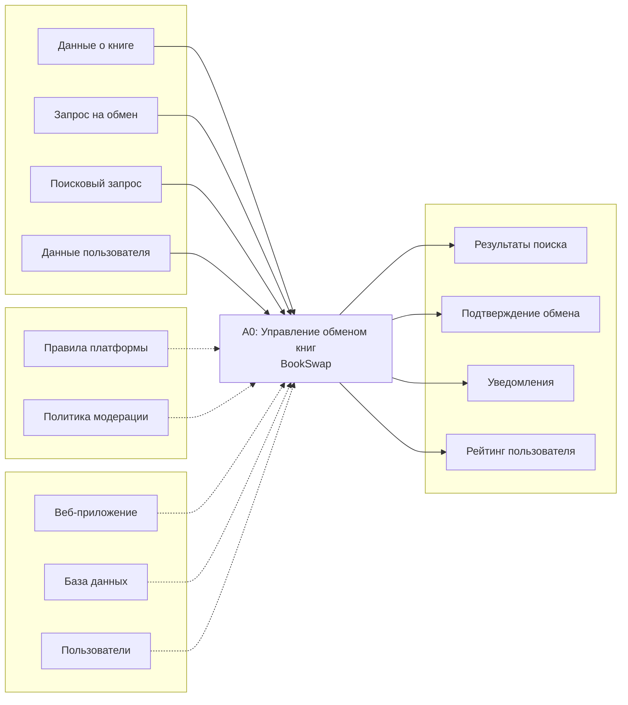
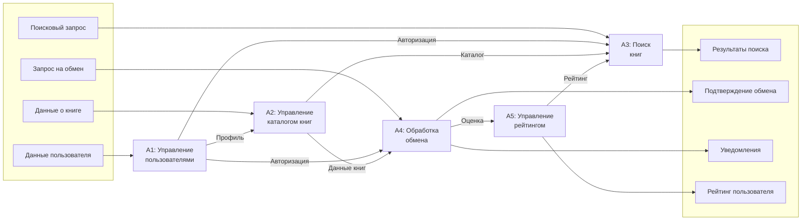

# 2.3. Модель в нотации IDEF0

## Контекстная диаграмма A-0

## Декомпозиция первого уровня A0

## Комментарии к модели IDEF0

### Контекстная диаграмма A-0

Диаграмма верхнего уровня представляет систему BookSwap как единый функциональный блок «Управление обменом книг».

**Входы (слева):**
- *Данные о книге* — информация, вводимая пользователем при добавлении книги в каталог (название, автор, ISBN, состояние, фото)
- *Запрос на обмен* — заявка от пользователя на получение книги у другого участника
- *Поисковый запрос* — критерии поиска (текст, фильтры, геолокация)
- *Данные пользователя* — регистрационные данные, настройки профиля

**Выходы (справа):**
- *Результаты поиска* — список книг, соответствующих критериям
- *Подтверждение обмена* — фиксация успешно завершённой сделки
- *Уведомления* — информирование пользователей о событиях (новый запрос, сообщение, книга из wishlist)
- *Рейтинг пользователя* — агрегированная оценка надёжности участника

**Управление (сверху):**
- *Правила платформы* — пользовательское соглашение, условия использования
- *Политика модерации* — правила обработки жалоб и блокировки контента

**Механизмы (снизу):**
- *Веб-приложение* — программный интерфейс системы
- *База данных* — хранилище информации (PostgreSQL)
- *Пользователи* — участники платформы, выполняющие действия

### Декомпозиция A0

Система разбита на пять функциональных блоков:

**A1: Управление пользователями**
Регистрация, авторизация, редактирование профиля, верификация. Выход — профиль пользователя, который используется остальными подсистемами для идентификации и проверки прав.

**A2: Управление каталогом книг**
Добавление, редактирование, удаление книг. Управление статусом доступности. Ведение wishlist. Формирует каталог, который используется для поиска и обмена.

**A3: Поиск книг**
Полнотекстовый поиск, фильтрация, геолокационный поиск. Использует каталог из A2 и рейтинги из A5 для ранжирования результатов.

**A4: Обработка обмена**
Ключевой процесс: приём запроса → согласование → подтверждение → фиксация. Включает внутренний чат между участниками. Генерирует уведомления и инициирует выставление оценок.

**A5: Управление рейтингом**
Сбор оценок и отзывов после завершения обмена. Расчёт среднего рейтинга. Предоставление данных для ранжирования в поиске и отображения в профиле.