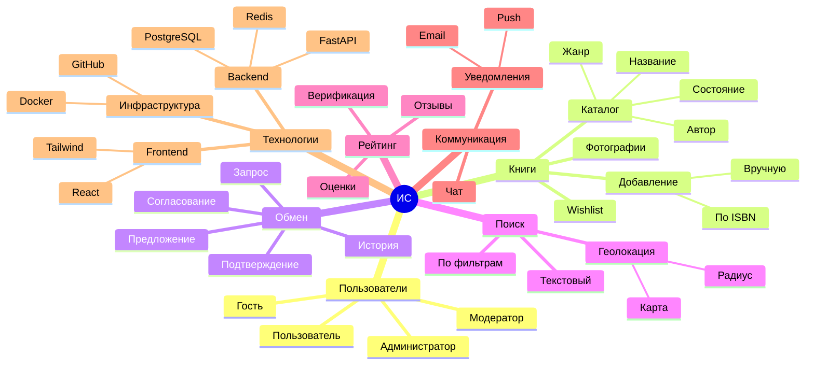

# 2.2. Ментальная карта

## Диаграмма

## Комментарии к ментальной карте

### Пользователи
Система предусматривает четыре роли с разным уровнем доступа. Гость может только просматривать каталог, пользователь — полноценно участвовать в обменах, модератор — разрешать спорные ситуации, администратор — управлять всей системой.

### Книги
Центральная сущность системы. Книгу можно добавить вручную, заполнив форму, или автоматически по ISBN через интеграцию с внешними API (OpenLibrary, Google Books). Каждая книга имеет атрибуты: название, автор, жанр, состояние (новая/хорошее/удовлетворительное). Пользователь может загрузить фотографии и вести список желаемых книг (wishlist).

### Обмен
Ключевой бизнес-процесс платформы. Состоит из этапов: отправка запроса → предложение встречной книги (опционально) → согласование деталей в чате → подтверждение обмена обеими сторонами. Вся история сохраняется в профиле пользователя.

### Поиск
Три механизма поиска: полнотекстовый (по названию, автору), фильтрация (жанр, состояние, язык) и геолокационный (поиск в заданном радиусе с отображением на карте). Геолокация — ключевое преимущество перед аналогами.

### Рейтинг
Система доверия между пользователями. После каждого обмена участники выставляют друг другу оценку (1–5 звёзд) и могут оставить текстовый отзыв. Дополнительно предусмотрена верификация профиля через email и телефон.

### Коммуникация
Встроенный чат для согласования деталей обмена (время, место встречи). Система уведомлений информирует о новых запросах, сообщениях и появлении книг из wishlist поблизости. Поддерживаются email и push-уведомления.

### Технологии
Стек разделён на три уровня. Backend: FastAPI (Python) + PostgreSQL с PostGIS + Redis для кэширования. Frontend: React + Tailwind CSS + картографический сервис. Инфраструктура: Docker для контейнеризации, GitHub для хостинга кода и CI/CD.