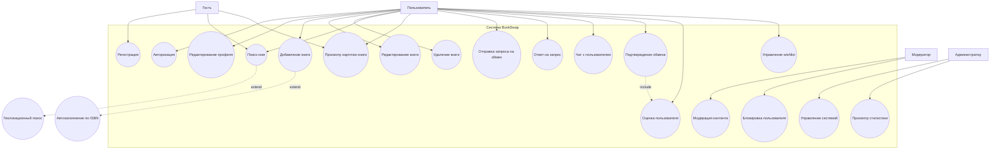
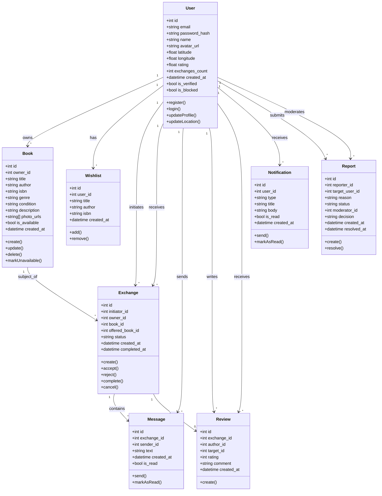
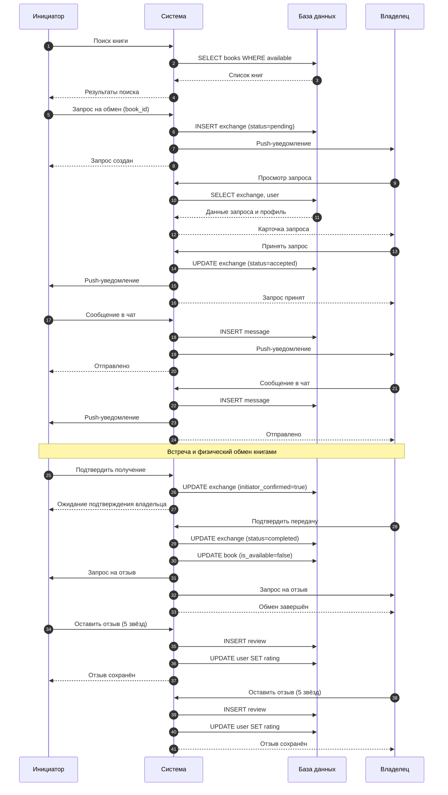

# 2.6. Модели в нотации UML

## 2.6.1. Диаграмма вариантов использования (Use Case) — поведенческая

### Комментарии к диаграмме Use Case

**Акторы:**

| Актор | Описание |
|-------|----------|
| Гость | Неавторизованный пользователь. Может просматривать каталог и регистрироваться |
| Пользователь | Авторизованный участник. Полный доступ к функциям обмена |
| Модератор | Сотрудник платформы. Разбирает жалобы и блокирует нарушителей |
| Администратор | Технический специалист. Управляет настройками и просматривает статистику |

**Основные варианты использования:**

- *Регистрация / Авторизация* — создание аккаунта и вход в систему
- *Добавление книги* — внесение книги в личную библиотеку с возможностью автозаполнения по ISBN (extend)
- *Поиск книг* — текстовый и фильтрованный поиск с расширением геолокации (extend)
- *Отправка запроса на обмен* — инициация обмена книгами
- *Подтверждение обмена* — фиксация завершённой сделки, обязательно включает оценку (include)
- *Управление wishlist* — ведение списка желаемых книг

---

## 2.6.2. Диаграмма классов (Class Diagram) — структурная

### Комментарии к диаграмме классов

**Основные сущности:**

| Класс | Описание |
|-------|----------|
| User | Пользователь системы. Хранит учётные данные, геолокацию, рейтинг |
| Book | Книга в каталоге. Принадлежит пользователю, имеет статус доступности |
| Wishlist | Желаемая книга. Связь с пользователем без привязки к конкретному экземпляру |
| Exchange | Обмен. Связывает инициатора, владельца и книгу. Имеет статус жизненного цикла |
| Message | Сообщение в чате обмена. Привязано к конкретному Exchange |
| Review | Отзыв после обмена. Каждый участник может оставить один отзыв |
| Notification | Уведомление пользователя о событиях в системе |
| Report | Жалоба на пользователя. Обрабатывается модератором |

**Ключевые связи:**

- User → Book: один пользователь владеет многими книгами (1:*)
- User → Exchange: пользователь может быть инициатором или владельцем (1:*)
- Exchange → Message: один обмен содержит много сообщений (1:*)
- Exchange → Review: один обмен может иметь до двух отзывов — от каждой стороны (1:0..2)

**Статусы Exchange:**
- `pending` — ожидает ответа владельца
- `accepted` — принят, идёт согласование
- `rejected` — отклонён владельцем
- `completed` — обмен завершён
- `cancelled` — отменён одной из сторон

---

## 2.6.3. Диаграмма последовательности (Sequence Diagram) — поведенческая

### Сценарий: Успешный обмен книгами

### Комментарии к диаграмме последовательности

**Участники:**
- Инициатор — пользователь, желающий получить книгу
- Система — серверная часть BookSwap
- База данных — PostgreSQL
- Владелец — пользователь, владеющий книгой

**Этапы сценария:**

1. **Поиск (шаги 1–4):** Инициатор ищет книгу, система возвращает доступные варианты.

2. **Создание запроса (шаги 5–8):** Инициатор отправляет запрос, система сохраняет его со статусом `pending` и уведомляет владельца.

3. **Рассмотрение запроса (шаги 9–12):** Владелец просматривает профиль инициатора и принимает решение.

4. **Принятие (шаги 13–16):** Статус меняется на `accepted`, инициатор получает уведомление.

5. **Согласование в чате (шаги 17–24):** Стороны обмениваются сообщениями для договорённости о месте и времени встречи.

6. **Подтверждение обмена (шаги 25–32):** После физической встречи обе стороны подтверждают факт обмена. Книга помечается как недоступная.

7. **Отзывы (шаги 33–40):** Каждый участник оставляет оценку, рейтинги обновляются.